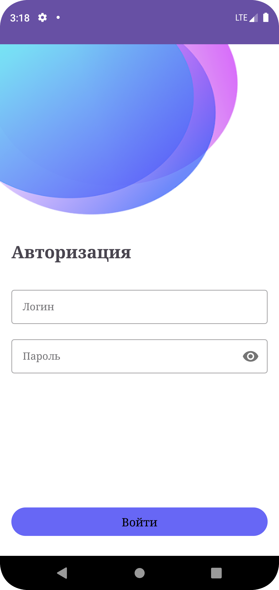
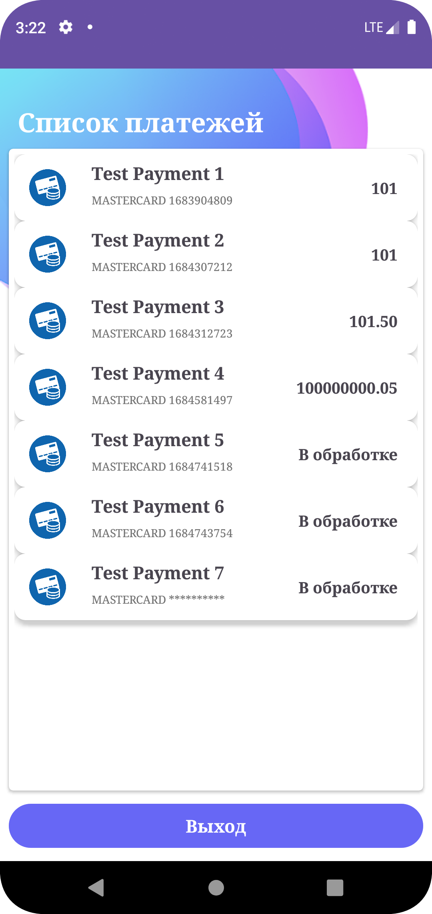

# Test_Task

---

## Описание
Приложение с возможностью авторизации пользователя и вывода списка его платежей после успешной авторизации. 

---

##### Требования к функционалу:

- если логин/пароль неправильные - выводим ошибку
- надо предусмотреть возможность logout'а
- корректный вывод списка платежей при ошибочных данных (пропущенные поля, несоответствие типу)

---

##### Требования к коду:

Kotlin, Retrofit, Coroutines
простая архитектура и логика

API:

Базовый URL, в заголовках надо передавать app-key и v

POST /login - логин, передаем параметры в json , при корректном запросе в ответ приходит токен.

GET /payments - список платежей, для корректного запроса в заголовках передаем ранее полученный токен token='...'

---

### Зависимости

* Retrofit version = "2.9.0"
* Dagger_Hilt =  "2.46.1"
* Navigation = "2.6.0"
* Coroutine

---
### Скриншоты

 

 

 

---

### Архтитектура

* Простая Архитектура, как и требовалось в задании.
* MVVM

---

### Структура проекта

`AndroidManifest.xml` — файл с описанием разрешений для приложения, указаниями файлов, отображения и т.д.

##### Все файлы находся в папке `app`:

* `api` папка где находятся интерфейс для взаимодействия с вызовом в сеть с помощью Retrofit

* `di` --- в ней находятся классы для dependency injection(HttpClient, interfaceApi, repository)

* `model` — папка, в которой находится модель для данных, которые будут отображаться  

* `repository` — папка, в которой находятся интерфейс и имплементация repository

* `view` --- папка с Фрагментами и Адатером для RecyclerView

* `viewModel` — папка, в которой находится viewModel и sealed interface UI состояния.

---
